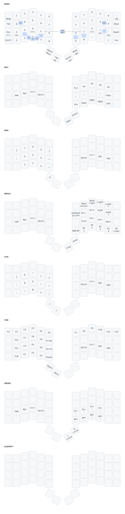
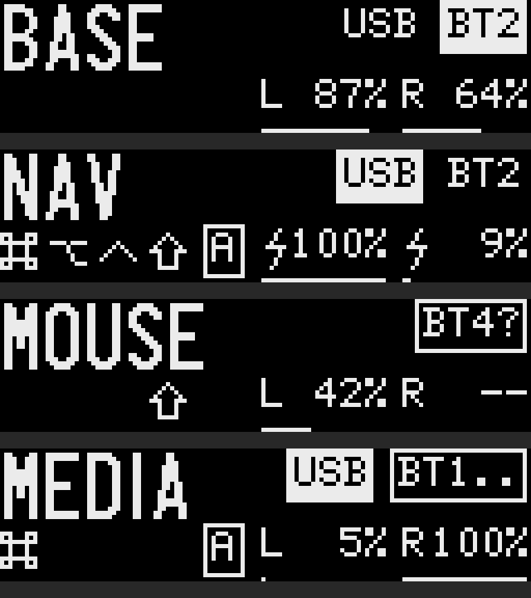

# Parix 52

Firmware for the **Parix 52**, a 52-key wireless split keyboard with the ZSA Voyager's
layout, low-profile Choc switches, per-key lighting and a trackpad on the right half.
It runs [RMK](https://github.com/HaoboGu/rmk), a keyboard firmware written in Rust, on
an nRF52840 controller in each half. The two halves talk to each other over Bluetooth,
and the keyboard talks to your computer over Bluetooth or USB.

This page is the manual. The hardware design (PCB, case) lives in
[dieselsaurav/paraboard](https://github.com/dieselsaurav/paraboard).

- [The keymap](#the-keymap)
- [Connecting: USB and Bluetooth](#connecting-usb-and-bluetooth)
- [The trackpad](#the-trackpad)
- [Lights and screens](#lights-and-screens)
- [Battery](#battery)
- [Changing the keymap with Vial](#changing-the-keymap-with-vial)
- [Updating the firmware](#updating-the-firmware)
- [If something goes wrong](#if-something-goes-wrong)
- [Building from source](#building-from-source)
- [Hardware reference](#hardware-reference)

## The keymap



The drawing above is generated from the firmware's own keymap file after every change,
so it is always what the keyboard ships with. Download it at full size:
[docs/keymap.svg](docs/keymap.svg).

**How to read it.** A small word under a key is what the key does when **held**: the
home row holds modifiers (A = Cmd, S = Opt, D = Ctrl, F = Shift, mirrored on the right),
and the four thumb keys and the two outer corners of the number row each hold a layer.
Keys drawn between two keys are **combos**: press both together.

| Layer | Hold | What is on it |
|---|---|---|
| **BASE** | – | QWERTY, number row, Hyper (⌃⌥⇧⌘) on the right pinky |
| **NAV** | Tab (left thumb) | Arrows on H J K L, Home/End/PgUp/PgDn, Cmd-Z/X/C/V, Caps Lock |
| **NUM** | Backspace (right thumb) | Number pad on the left hand, brackets and symbols around it |
| **SYM** | Enter (right thumb) | The same positions as NUM, shifted: `{ } ( ) & * ! @` … |
| **MEDIA** | Space (left thumb) | Screens, key lights, media and volume, USB/BT switch, Bluetooth profiles |
| **FUN** | `-` (top right) | F1–F12 on the left hand, Print Screen, Scroll Lock, Pause |
| **MOUSE** | `` ` `` (top left) | Cursor and wheel keys, mouse buttons on the right thumbs; also switched on by the trackpad |
| **DISPOFF** | Space + H toggles | Nothing: lights and screens go dark |

**Combos** (press together): Q+W = Esc, O+P = Backspace, F+J = Caps Word, X+C = Cmd-C,
C+V = Cmd-V, X+V = Cmd-X, J+M = `-`, H+N = `_`, F+V = `=`, S+X = `` ` ``, L+' = `;`.

**Tap-hold timing.** A home-row key is a letter when tapped and a modifier when held
(about 200 ms), and it never becomes a modifier for a key on the same hand, so rolling
"as" or "df" types the letters. A layer key (the thumbs and the two top corners) becomes
a layer only once it has been held for that fifth of a second: press the next key sooner
and you get the tap, so a quick "space, n" is always a space and an n.

## Connecting: USB and Bluetooth

The **left half is the brain**: it connects to the computer and runs the keymap. The
right half connects to the left over Bluetooth by itself; nothing to pair there.

- **USB:** plug the left half in. It types over USB whenever Bluetooth is not connected.
- **Bluetooth:** pair "Parix 52" in your computer's Bluetooth settings. Four computers can
  be remembered, one per profile. With Space held:

| Space + | Does |
|---|---|
| M , . / | Switch to Bluetooth profile 1, 2, 3, 4 |
| M , . / held for 5 seconds | Forget that profile's pairing and open it for pairing again |
| N | Switch typing between USB and Bluetooth when both are connected |

Pairing is remembered across power-offs. **After a firmware update that changes the
keymap file, all pairings are cleared** (see [Updating](#updating-the-firmware)); then
forget "Parix 52" on the computer and pair again, otherwise the computer keeps trying
the old pairing.

## The trackpad

The right half carries a 40 mm Cirque trackpad.

- **Pointer:** touch and move anywhere on the pad.
- **Click:** tap the pad (a touch shorter than a fifth of a second that stays where it
  landed) for a left click.
- **Glide:** flick and lift while your finger is still moving, and the pointer coasts to a
  stop, which covers a large screen in one stroke. Touch the pad to stop it. A slow move
  ends where you end it.
- **Scroll:** land on the **outer ring** (the outer fifth of the pad's radius, about
  4 mm) and run your finger around it, like a wheel. Clockwise scrolls down. A touch
  that lands on the ring and moves towards the middle instead is an ordinary pointer
  move, so starting a move from the edge does not scroll.
- **Other buttons:** moving the pointer switches the keyboard to the MOUSE layer for
  about two-thirds of a second after the last movement. While it is on, the right thumb
  keys are mouse buttons, **Enter = left click, Backspace = right click**, the right
  home row moves the pointer in steps and the row below it scrolls. The lights turn
  cyan while this layer is on. You can also hold `` ` `` to reach the same layer.
- After a minute without any key or pointer move the keyboard sleeps and the pad is
  switched off with the lights: press any key first, then use the pad.

The trackpad only works with the right half linked to the left; it needs no pairing of
its own.

## Lights and screens

Every key has a light under it, and the legends on the white keycaps show only when
their key is lit. The base layer starts dark: plain white caps, nothing to distract you
and very little drawn from the battery (you can switch it on, below). Hold a layer key and that layer's live keys light
up, legends and all, coloured by what they do: digits green, symbols orange, arrows and
Bluetooth profiles blue, media violet, modifiers yellow, editing keys magenta, F-keys
and "everything dark" red. A key that does nothing there stays dark.

- After **one minute** without a key or a pointer move on either half, the key lights
  go dark. Everything else stays on: press a key or touch the trackpad and they are back.
- After **ten minutes** the keyboard sleeps: the supply to the lights, the screen and the
  trackpad is switched off completely, which is what makes the battery last. **Press any
  key on either half to wake it.** The trackpad cannot wake a sleeping keyboard, because
  it has no power then; it responds again about a quarter of a second after the key.

All the controls are on the right hand while you hold **Space**, one subject per row:

| Space + | Does |
|---|---|
| 7 / 8 | Computer screen dimmer / brighter |
| 9 / 0 | The keyboard's own screen dimmer / brighter (five subtle steps) |
| Y | Base layer light on / off. It starts off. On, every key glows one colour so the legends read, and the six layer keys show the colour of the layer they open |
| U | Next base look: white, blue, cyan, green, yellow, orange, red, magenta, then a rainbow that sweeps across both halves |
| O / P | All key lights dimmer / brighter (eight steps). The top steps are bright and shorten battery life noticeably while the base light is on |
| H | Everything dark, lights and screen, until you press it again |
| J K L ' | Previous track, volume down, volume up, next track |
| right thumbs | Play / pause, mute |

Press one of the light keys and, while you keep Space held, the whole keyboard shows
the base layer as it will look, so you see the colour and brightness change as you
step. With the base light off, the Y key is red. The light and screen settings are
remembered across power-offs and apply to both halves.

The left half has a small screen (the right has the trackpad in its place):



| Where | What |
|---|---|
| Top left | The layer in use |
| Top right | The links to your computer: `USB` when one is plugged in, and `BT` with the profile number (1–4). **The one in the filled box is where your typing is going.** `BT2` alone = connected; `BT2..` = paired, looking for its computer; `BT2?` = nothing paired on this profile, open for pairing. Space + N chooses between the two. If the one you chose cannot be used (Bluetooth chosen but its computer is not connected), typing stays on the other and your choice is shown as an **outline**; it takes over as soon as it connects |
| Bottom left | The modifiers held right now, as their Mac symbols (⌘ ⌥ ⌃ ⇧), and a boxed **A** while Caps Lock is on |
| Bottom right | Both batteries, left then right, with a bar under each. A bolt replaces the letter while that half is plugged in and charging; `--` means the right half is not linked |

The screen runs at its dimmest setting. To change it, set `OLED_BRIGHTNESS` (0 dimmest to 4
brightest) in `src/status.rs` and reflash the left half; pairings are kept.

## Battery

Each half takes a 3.7 V lithium-polymer cell on a JST-PH plug, switched by the slide
switch on the board. Charging is through the USB port of each half, at about 100 mA
(roughly ten hours for a 1000 mAh cell); the charger works whether the switch is on or
off. The left half reports its level to the computer; the screen shows both halves.

The percentage is an estimate from the cell's voltage, read along a lithium-polymer
discharge curve and smoothed over a few seconds. Expect it to be right to within about
five to ten points; it reads a few points high while a half is charging (the bolt on
the screen), and settles a few minutes after unplugging.

The lights are most of the power budget: a half with its lights on draws around
60–100 mA, and the LED chips keep taking about 15 mA even when dark, until the keyboard
sleeps and switches their supply off. With the one-minute sleep, a day of normal use costs roughly 150–300 mAh per half. Use the slide
switch when the keyboard is put away for long.

## Changing the keymap with Vial

The keymap can be edited live, no reflashing, with [Vial](https://get.vial.today)
(desktop app) or [vial.rocks](https://vial.rocks) in Chrome.

1. Connect the **left half by USB**. If it is also connected over Bluetooth, Vial may
   pick the Bluetooth entry and fail: disconnect it in the computer's Bluetooth menu
   first, or choose the other "Parix 52" in Vial's device list.
2. Open Vial. When it asks you to unlock, **hold both left thumb keys** (Space and Tab)
   until it continues.
3. Change keys, layers, combos; every change is saved on the keyboard at once.

Vial keeps its changes in the keyboard's memory. A firmware update that changes the
keymap file resets them (the update says so); plain firmware updates keep them.

## Updating the firmware

The latest firmware built from this repository is always at
**[Releases → latest](https://github.com/dieselsaurav/parix52/releases/tag/latest)**:

| File | Goes on |
|---|---|
| `parix52-rmk-central.uf2` | the **left** half |
| `parix52-rmk-peripheral.uf2` | the **right** half |
| `parix52-rmk-reset.uf2` | either half, only to wipe its memory (see below) |

To flash a half:

1. Connect it by USB.
2. Press the reset button **twice quickly**. A drive called `NICENANO` appears on the
   computer.
3. Copy the `.uf2` file for that half onto the drive. The drive disappears and the half
   restarts with the new firmware within a few seconds. (If the computer complains that
   the copy failed at the very end, that is normal; the half had already restarted.)

Update both halves from the same release; they must match. Changes that only touch the
keymap need only the left half.

**Memory wipe.** When the keymap file (`config/keyboard.toml`) changes between releases,
the first start of the new firmware clears the keyboard's stored settings: Bluetooth
pairings, Vial edits, the selected profile. Forget "Parix 52" on your computers and pair
again. The release notes say when this applies.

## If something goes wrong

**The computer shows "Parix 52" but typing does nothing, or it keeps connecting and
disconnecting.** The computer still holds an old pairing. Forget the device in the
Bluetooth settings and pair again.

**Keys from one half don't type.** The halves have lost each other. Switch both off at
the slide switch, wait a few seconds, switch the left on first, then the right.

**A half won't take a firmware file / the `NICENANO` drive never appears.** Try the
double-tap on the reset button again (two presses within half a second); try another
cable or USB port. The bootloader is independent of the firmware, so a failed flash never
"bricks" the half: double-tap again and copy the file again.

**Vial won't connect.** Use USB, not Bluetooth, and unlock with both left thumb keys
(see [Vial](#changing-the-keymap-with-vial)).

**Start over.** Flash `parix52-rmk-reset.uf2` on a half: it wipes that half's stored
memory (pairings, Vial edits), blinks the module's blue LED slowly when done, and waits.
Then flash the normal firmware for that half again.

## Building from source

```sh
rustup target add thumbv7em-none-eabihf
cargo install cargo-make
cargo make uf2            # build/parix52-rmk-{central,peripheral,reset}.uf2
cargo make keymap         # docs/keymap.svg (needs: pip install keymap-drawer==0.23.0)
```

Rust 1.96.1 is pinned in `rust-toolchain.toml` (the vendored RMK does not build on newer
compilers). GitHub Actions builds every push, attaches the three `.uf2` files to the
run, refreshes the `latest` release on pushes to `main`, and redraws `docs/keymap.svg`
and commits it back whenever the keymap changed.

Where things are:

| Path | What |
|---|---|
| `config/keyboard.toml` | The keymap and the whole hardware description: pins, layers, combos, tap-hold timing, Bluetooth, trackpad, storage. Read at compile time. Changing it wipes the keyboard's stored settings at the next start. |
| `config/vial.json` | The layout as Vial draws it; also the source of the key positions in `docs/keymap.svg` |
| `src/central.rs`, `src/peripheral.rs` | The two binaries, one per half |
| `src/rgb.rs`, `src/rgb_map.rs` | The LED driver (nRF PWM, SK6812 timing) and the per-key colours per layer |
| `src/status.rs` | The left half's screen |
| `src/reset.rs` | The memory-wipe image |
| `vendor/rmk`, `vendor/nrf-mpsl` | RMK and Nordic's MPSL bindings, with this keyboard's changes; each `*PATCH*.md` there says what was changed and why |
| `scripts/` | Flashing helpers for macOS, the keymap renderer, passive Mac-side monitors |

## Hardware reference

Per half: nRF52840 Pro Micro-style module (nice!nano v2 or compatible), 26 Kailh Choc
hotswap switches, 26 SK6812MINI-E LEDs, a JST-PH battery plug with slide switch, a
display header (SSD1306 OLED on the left, the Cirque TM040040 trackpad on the right).

| Signal | Pro Micro pin | nRF52840 |
|---|---|---|
| Rows R0–R4 | 4, 5, 6, 7, 8 | P0.22, P0.24, P1.00, P0.11, P1.04 |
| Columns C0–C5 (C0 = outer column on both halves) | 21, 20, 19, 18, 15, 14 | P0.31, P0.29, P0.02, P1.15, P1.13, P1.11 |
| LED data | 0 | P0.08 |
| Display header: SDA/MOSI, SCL/SCK, CS | 2, 3, 1 | P0.17, P0.20, P0.06 |
| Trackpad MISO, data-ready (right half) | 9, 10 | P1.06, P0.09 |

Matrix 5 rows × 12 columns, COL2ROW; row 4 is the thumb row (two keys a side).
Left half = central, right half = peripheral; the halves find each other by fixed
Bluetooth addresses set in `keyboard.toml`.

**Going back to ZMK or another firmware:** RMK uses Nordic's newer Bluetooth controller
instead of the SoftDevice, so before flashing a SoftDevice-based firmware (ZMK) you must
first re-flash the
[nice!nano bootloader](https://nicekeyboards.com/docs/nice-nano/troubleshooting#my-nicenano-seems-to-be-acting-up-and-i-want-to-re-flash-the-bootloader).

## Licence

This firmware is MIT OR Apache-2.0, like RMK. Vendored code keeps its own licences
(see `vendor/*/LICENSE-*`).
